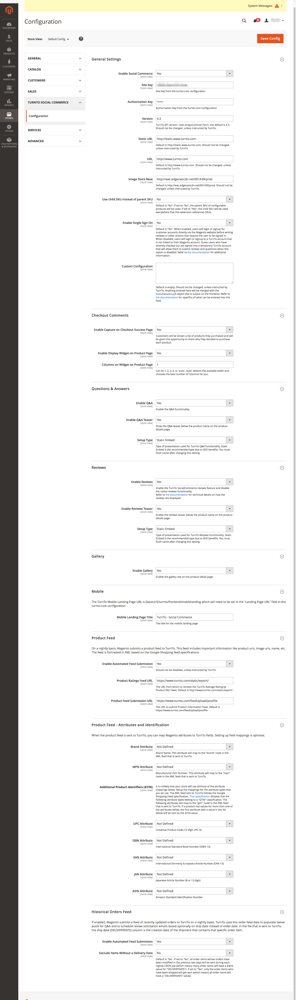
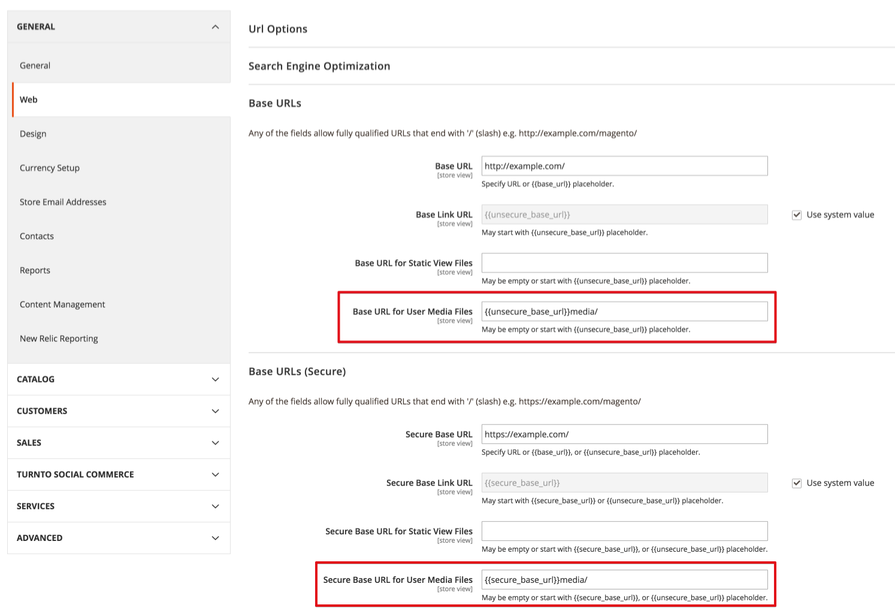
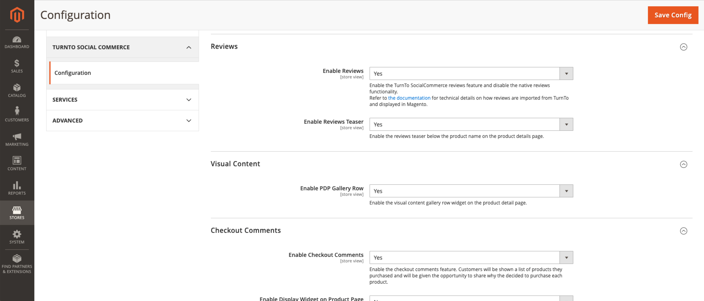

# Overview

This repository contains a Magento 2 extension that connects Magento 2 with TurnTo's Social Commerce service. Compatible with Magento Community and Enterprise, versions 2.1.x - 2.3.x.

# Installation Instructions

## Install using Composer (recommended)

1. Run these commands in your root Magento installation directory:

    ```
    composer require turnto/social-commerce
    bin/magento module:enable --clear-static-content TurnTo_SocialCommerce
    bin/magento setup:upgrade
    bin/magento cache:flush
    ```

2. If you are deploying the extension to a production environment, follow the [devdocs.magento.com deployment instructions](http://devdocs.magento.com/guides/v2.1/config-guide/prod/prod_deploy.html#deploy-prod)
3. Configure the module to connect to your TurnTo account. Please see the General Configuration section bellow.
## Install by copying files

1. Create an `app/code/TurnTo/SocialCommerce` directory in your Magento installation.
2. Download the latest "Source code" from this page: [https://github.com/turnto/magento2-turnto-socialcommerce/releases](https://github.com/turnto/magento2-turnto-socialcommerce/releases)
3. Extract the file and copy the contents of the TurnTo_SocialCommerce-*** directory into the `app/code/TurnTo/SocialCommerce` directory.
4. Run following commands from your root Magento installation directory:

    ```
    bin/magento module:enable --clear-static-content TurnTo_SocialCommerce
    bin/magento setup:upgrade
    bin/magento cache:flush
    ```

5. If you are deploying the extension to a production environment, follow the [devdocs.magento.com deployment instructions](http://devdocs.magento.com/guides/v2.1/config-guide/prod/prod_deploy.html#deploy-prod)
6. Configure the module to connect to your TurnTo account. Please see the General Configuration section bellow.

# Documentation

## General Configuration

It is imperative that you add you your TurnTo site key and auth key. TurnTo Site keys allow the Magento extension to connect to your TurnTo account.
You can find your Site Key and Auth Key in the [TurnTo portal](https://www.turnto.com/secure/login/auth) or by contacting your TurnTo Customer Success team.

After installing the extension, login to the backend and configure the extension in **STORES > Configuration > TURNTO SOCIAL COMMERCE > Configuration**. Here is a screenshot of the extension as of version 1.0.3 (click to zoom):

[](https://raw.githubusercontent.com/turnto/magento2-turnto-socialcommerce/develop/README/turnto_socialcommerce_configuration.png)

## CRON Configuration

This extension depends on the Magento CRON being configured in order to work properly. Reference the [Magento DevDocs](http://devdocs.magento.com/guides/v2.2/config-guide/cli/config-cli-subcommands-cron.html) for details on how to configure the Magento CRON.

## Catalog Feed Export to TurnTo

If the **Enable Automated Feed Submission** configuration option is set to **Yes**, on a nightly basis, Magento will export a feed of all products to TurnTo. This feed will include links to product images. In order for this link to be accurate, you will need to do the following:

1. Login to the backend.
2. Go to **STORES > Configuration > GENERAL > Web**
3. Do the following (if you have multiple store views, follow these steps for each "Store View" scope):
    1. For the **Base URLS > Base URL for User Media Files** field, ensure a value is entered. If the field is blank, enter this value: `{{unsecure_base_url}}media/`
    2. For the **Base URLS (Secure) > Secure Base URL for User Media Files** field, ensure a value is entered. If the field is blank, enter this value: `{{secure_base_url}}media/`
Here is a screenshot of an example configuration:
 


##### **If your store has 10,000 or more items in the catalog:**
If your catalog has 10,000 or more items, the size of the export file can reach over 6Mb. Please check your php.ini or your htaccess files to ensure
that **upload_max_filesize** and **post_max_size** are set to a large enough value. We recommend setting them both to 10M. 
 

## Rating Import from TurnTo

If the **Enable Reviews** configuration option is set to **Yes**:

1. The reviews that display on product detail pages will be loaded directly from TurnTo. Exactly how the review data gets pull from TurnTo is determined by the **Setup Type** setting.

2. The reviews that display on product listing pages will be loaded from the "Review Count" and "Rating" product attributes. Those attributes get updated on a CRON job that runs hourly. The CRON job will request an XML feed from TurnTo and will update those product attributes. If you encounter issues where those attributes are not updated like you'd expect, you can manually review the contents of the XML feed that Magento is retrieving from TurnTo by creating a url that matches this pattern: `http://www.turnto.com/static/export/<SITE KEY>/<AUTHORIZATION KEY>/turnto-skuaveragerating.xml` where `<SITE KEY>` and `<AUTHORIZATION KEY>` are the values you entered into the corresponding fields in the TurnTo configuration fields in the admin. The XML file is generated by TurnTo twice daily (at 3AM EST and 11AM EST), so once you approve a new review for a product, you'll need to wait a while to see the changes reflected in the XML file.


## Custom Configuration

Note: This is an advanced configuration option and should only be configured by a developer.

If you'd to customize the `turnToConfig` JS object that gets output whenever TurnTo is used on the frontend, you can do so by adding a JS object to the **STORES > Configuration > TURNTO SOCIAL COMMERCE > Configuration > Custom Configuration** field. You must enter a valid JS object into this field, as the contents of the JS object that you enter will get __merged__ with the contents of the existing `turnToConfig` object. [Event Callbacks](https://turnto.zendesk.com/hc/en-us/articles/207957286-Event-Callbacks-4-3) are one example of what you might want to add to this config field. Here is an example of a valid value that could be added to the **Custom Configuration** field:

```
{
    reviewTitleInstruction: 'Summary for your review',
    eventHandlers: {
         reviewSubmit: function(evt) {
            // your code here
         }
    }
}
```

These are the following locations where the `turnToConfig` object gets output on the frontend:

* Product detail pages (reviews, Q&A, checkout comment display widget, visual gallery widget)
* Checkout comments on checkout confirmation page
* Pinboard widget
* Mobile landing page

When you add values to this configuration field, it is critical that you enter a valid JS object and that you test to ensure you didn't cause any JS errors. 

## Visual Content and Checkout Comment Pinboards

The TurnTo extension implements a custom widget that allows an admin to insert "Visual Content" pinboards or "Checkout Comment" pinboards. To insert this widget, edit a CMS page or CMS block and click the "Insert Widget…" button and select "TurnTo SpeedFlex". You'll then be able to configure and insert the widget using these options:

[](https://raw.githubusercontent.com/turnto/magento2-turnto-socialcommerce/master/README/pinboard_widget.png)

## Visual Content Gallery Row Widget

The TurnTo extension implements a custom widget that allows a user to toggle a gallery row of user submitted images on the product page. To enable this widget, go to Stores -> Configuration -> TurnTo SocialCommerce -> Configuration -> Visual Content -> Enable PDP Gallery Row and set the value to "Yes."

[](https://raw.githubusercontent.com/turnto/magento2-turnto-socialcommerce/master/README/gallery_row_config.png)

## Troubleshooting

* **General** - If you experience issues with the extension, review the errors in the `var/log/turnto.log` file, as that is where all TurnTo errors are logged.
* **Issue when "Minify JavaScript Files" is enabled** - If you're using Magento's "Minify JavaScript Files" feature, see [this page](https://github.com/turnto/magento2-turnto-socialcommerce/issues/22#issuecomment-337093756) for details on how to get it working with this extension.
* **How to review product feed that is sent to TurnTo** - See this Github issue: [#27](https://github.com/turnto/magento2-turnto-socialcommerce/issues/27)

# About TurnTo Social Commerce

TurnTo is the fastest-growing provider of customer content solutions to top merchants and brands. With a unique suite of 4 innovative products that work beautifully together - Ratings & Reviews, Community Q&A, Visual Reviews, and Checkout Comments - TurnTo produces more content of more different types, delivering greater conversion lift, better SEO, and deeper merchandising insights. 

TurnTo clients enjoy a world-class Ratings & Reviews platform, a Q&A system designed to maximize customer engagement and help shoppers find fast answers from a variety of sources, a highly engaging source of real-time customer content with Checkout Comments, and a permissions-cleared source of customer photos and videos through Visual Reviews. TurnTo offers integrations with major eCommerce platforms and is built for the new world, reimagined for mobile, visual content, and messaging. ECommerce leaders like Saks Fifth Avenue, Newegg, Sur La Table, and GNC, and brands like Cole Haan, Jockey, and Clarins rely on TurnTo for their customer-voice programs.

# License

This project is licensed under the Open Software License 3.0 (OSL-3.0). See included LICENSE file for full text of OSL-3.0
